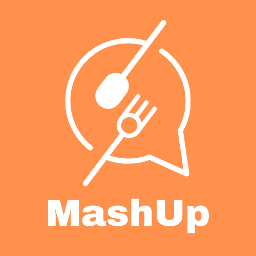

## MashUp - Frontend

    

The frontend of our project for the design project class. The project idea is to create an application that allows friends and family to upload restaurants that best match their food preferences.

### Group Members:
- Marc Chiu
- Hah-Young Kim
- Swanyee Aung
- Tahmid Asif

## Backend Repository:
https://github.com/Marc-Chiu/MashUp

## Main Pages
- Login Page
- Signup Page
- Home Page (Restaurant)
- Groups Page
- Group Home Page

## Setup and Run
1. Run `npm install` 
2. Use `npm start`
3. Accessible at  `http://localhost:3000`